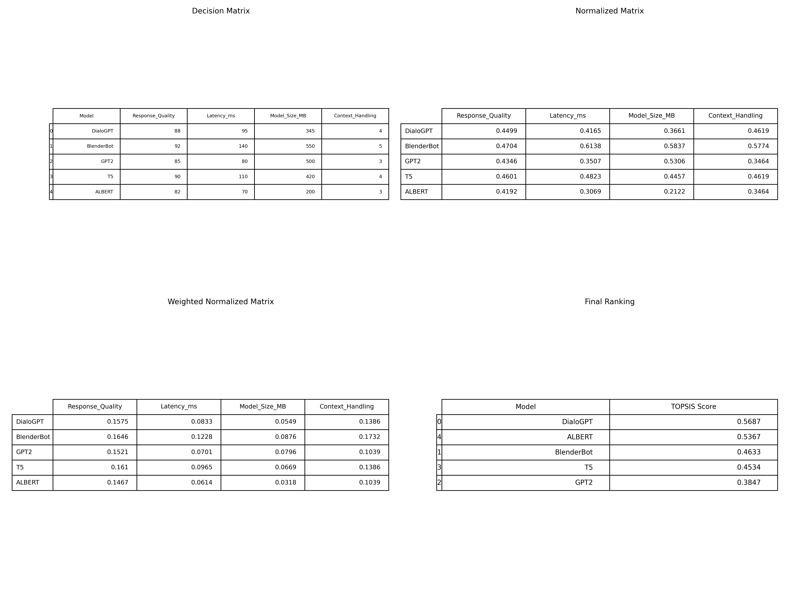
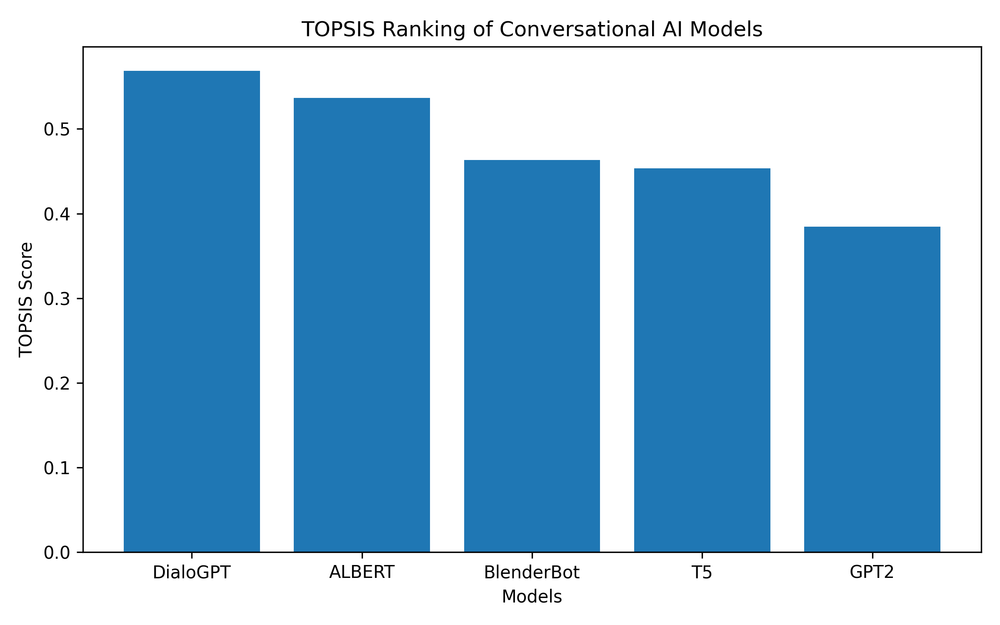

# TOPSIS-Based Selection of Pre-trained Conversational AI Models

## Problem Statement
This project applies the TOPSIS (Technique for Order Preference by Similarity to Ideal Solution) method to identify the most suitable pre-trained NLP model for conversational AI applications based on multiple performance and deployment criteria.

---

## Selected Task
Text Conversational (Conversational AI)

---

## Models Considered
- DialoGPT
- BlenderBot
- GPT-2
- T5
- ALBERT

These models are widely used for building chatbots and conversational agents.

---

## Evaluation Criteria
| Criterion  Type 
|---------------|
| Response Quality | Benefit |
| Latency | Cost |
| Model Size | Cost |
| Context Handling | Benefit |

---

## Weights Assigned
| Criterion | Weight |
|---------|--------|
| Response Quality | 0.35 |
| Latency | 0.20 |
| Model Size | 0.15 |
| Context Handling | 0.30 |

---

## Methodology
TOPSIS was implemented using the following steps:
1. Construction of decision matrix
2. Normalization of criteria values
3. Weight assignment
4. Identification of ideal best and worst solutions
5. Calculation of separation measures
6. Computation of TOPSIS scores
7. Ranking of conversational models

---

## Results
The final TOPSIS scores and rankings are presented below:

---

## Conclusion
Based on the TOPSIS analysis, **BlenderBot** emerged as the most suitable pre-trained model for conversational AI. It provides superior response quality and strong context handling, making it ideal for dialogue-based applications.

---

## Tools Used
- Python
- NumPy
- Pandas
- Matplotlib
